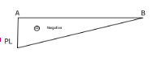

In General when the beam is subject to the loading it deflects, some of the moments and reactions occur in that beam. By determining the loads in the member at particular distance the bending moment and shear force can be calculated.

1. **Shear Force:** Shear force is an internal force in any material which is usually caused by any external force acting tangent (perpendicular) to the material axis, or a force which has a component acting tangent to the material axis.

2. **Bending Moment:** Bending moment is the algebraic sum of moments to the left or right of the section. In each case, by considering, either for forces or moments the resultants caused by applied forces to one side of the section is balanced by bending moment and shear force acting on the section.

**Cantilever (Point Load)** 

Variables:
Length = L
Load = P
Width = b
Depth = d
Rav = Vertical reaction means that is the force stopping the beam not to fall down due to applied force P
 
             

RAB = horizontal reaction 
MA = reactive moment 
RAV = P&#8593;  ; RAH = O
MA = PXL = PL 

1. Shear Force
SFD = P                              0<=X<=L

2. Bending moment 
BMD = PX-PL                     X is point on any length of beam

**Cantilever (UDL)**

Length = L
UDL = W kM/m
Breadth
Width 

1. Shear Force (SF)

SF = wx                              0<=x<=L
                  
2. Bending Moment (BM)

BM = -wL2/2 + wx2/2           0<=x<=L

**Fixed Beam (UDL)**

                        

1. Shear Force 

SF =wl/2 - wx (0<= x<=L)

2. Bending Moment 

M =  (wl/2) x - wx2/2 - wl2/ 12

At x=0 ,     M= -wl2/12
At x=L,      M= -wL2/12
At x=L/2,   M= +wL2/24

**Fixed Beam (Point Load)**

1. Shear force

Sf = w/2                    0<= x<= L/2
    = -w/2                   L/2<=x<= L

Sf = w/2                              0<= x<= L/2
    = -w/2                             L/2<=x<= L

2. Bending Moment (BM)

	

BM = WL/8                        at x=0
      = WL/8                        at x= L/2
      = WL/8                        at x=L

